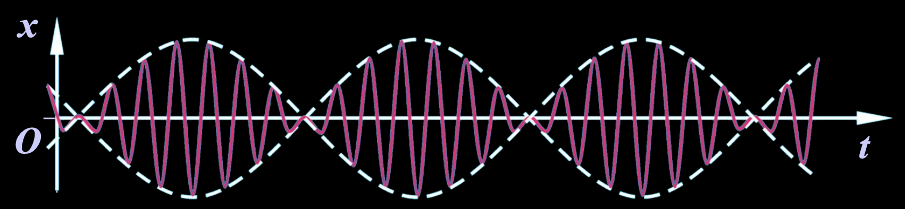
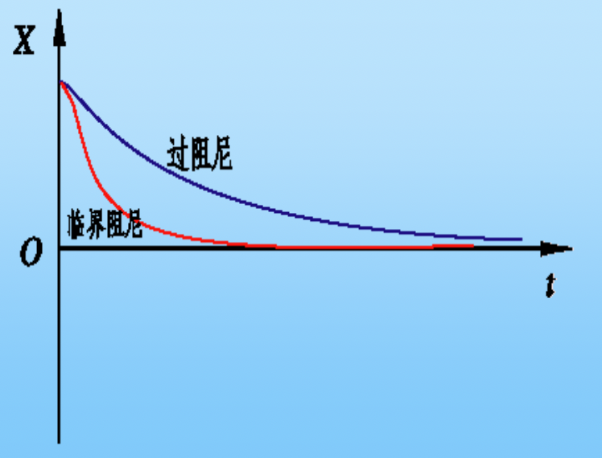
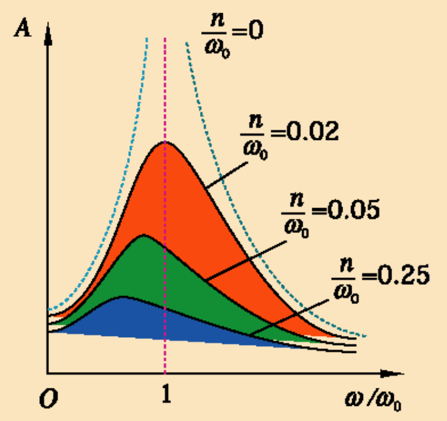
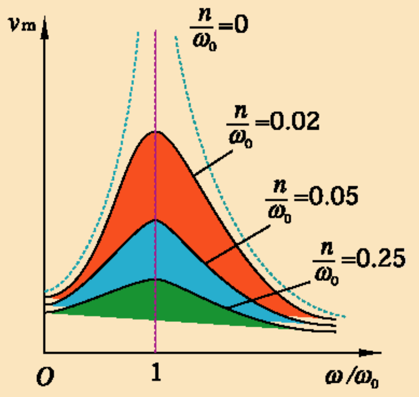

# 大学物理

## 机械振动

### 简谐振动

定义: $x(t) = Acos(\omega t+\varphi)$

特征量:

- 振幅 $A$
- 周期 $T$, 频率 $v$, 角频率 $\omega$. $T=\frac{2\pi}{\omega}, v=1/T$
- 相位 $\omega t + \varphi$, 初相 $\varphi$
- 速度: $v(t) = \frac{\mathrm{d}x}{\mathrm{d}t} = -\omega Asin(\omega t+\varphi), \varphi_v = \varphi + \frac{\pi}{2}$
- 加速度: $a(t) = \frac{\mathrm{d}v}{\mathrm{d}t} = -\omega^2Acos(\omega t+\varphi), \varphi_a = \varphi + \pi$

同相: $\Delta \varphi = \pm 2k\pi$, 两振动步调相同, 称为同相

反相: $\Delta \varphi = \pm (2k+1)\pi$, 两振动步调相反, 称为反相

#### 谐振子

受**线性回复力** $F=-kx$

动力学方程:

$$
F=-kx=ma \Rightarrow \frac{\mathrm{d}^2x}{\mathrm{d}t^2} + \omega^2x = 0 \Rightarrow x(t) = Acos(\omega t+\varphi)
\\
\omega = \sqrt{\frac{k}{m}}
$$

由初始条件确定的量:

$$
x = Acos(\omega t+\varphi) \Rightarrow x_0 = Acos(\varphi), v_0 = -\omega Asin(\varphi)
\\
A = \sqrt{x_0^2 + \frac{v_0^2}{\omega^2}}, \varphi = arctan(-\frac{v_0}{\omega x_0})
$$

#### 能量

- 动能

$$
E_k = \frac{1}{2}mv^2=\frac{1}{2}kA^2sin^2(\omega t+\varphi)
\\
E_{max}=\frac{1}{2}kA^2, E_{min}=0, \overline{E_k} = \frac{1}{T}\int_t^{t+T}E_k\mathrm{d}t = \frac{1}{4}kA^2
$$

- 势能

$$
E_p = \frac{1}{2}kx^2=\frac{1}{2}kA^2cos^2(\omega t+\varphi)
\\
E_{max}=\frac{1}{2}kA^2, E_{min}=0, \overline{E_p} = \frac{1}{T}\int_t^{t+T}E_p\mathrm{d}t = \frac{1}{4}kA^2
$$

- 机械能 (守恒)

$$
E = E_k + E_p = \frac{1}{2}kA^2
$$

### 简谐振动的合成

- 同方向 同频率

$$
x_1 = A_1cos(\omega t+\varphi_1),\  x_2 = A_2cos(\omega t+\varphi_2)
\\
x = x_1 + x_2 = Acos(\omega t+\varphi)
\\
A = \sqrt{A_1^2 + A_2^2 + 2A_1A_2cos(\varphi_1-\varphi_2)}, \varphi = arctan(\frac{A_1sin\varphi_1+A_2sin\varphi_2}{A_1cos\varphi_1+A_2cos\varphi_2})
$$

同频率简谐振动的合运动仍是简谐振动

- 同方向 不同频率 振幅相同

$$
x_1 = Acos\omega_1 t,\  x_2 = Acos\omega_2 t
\\
x = x_1 + x_2 = 2Acos\frac{\omega_1-\omega_2}{2}t \cdot cos\frac{\omega_1+\omega_2}{2}t
$$

$A(t) = 2Acos\frac{\omega_1-\omega_2}{2}t$ 随 $t$ 缓变, $cos\bar\omega t = cos\frac{\omega_1+\omega_2}{2}t$ 随 $t$ 快变

此时可以视为振幅缓变的简谐振动

- 垂直方向 同频率

$$
x = A_1cos(\omega t + \varphi_1),\  y = A_2cos(\omega t + \varphi_2)
\\
\frac{x^2}{A_1^2} + \frac{y^2}{A_2^2} - 2\frac{x}{A_1}\frac{y}{A_2}cos(\varphi_1-\varphi_2) = sin^2(\varphi_1-\varphi_2)
$$

- 当 $\Delta \varphi = k\pi$ 时, $\frac{x}{A_1} \pm \frac{y}{A_2} = 0$, 运动轨迹为直线
- 当 $\Delta \varphi = k\pi + \frac{\pi}{2}$ 时, 运动轨迹为圆
- 其余情况, 运动轨迹为椭圆

- 垂直方向 不同频率

振动频率为整数比时, 成周期性运动, 振动轨迹为闭合曲线, 称为**Lissajous图**

### 阻尼振动

阻尼力 $f = -\mu \dot{x}$

微分方程(以弹簧振子为例):

$$
m\ddot{x} = -kx-\mu\dot{x} \Rightarrow \ddot{x} + 2n\dot{x} + \omega_0^2x = 0
\\
\omega_0 = \sqrt{\frac{k}{m}}, n = \frac{\mu}{2m}
$$

$n$ 称为阻尼系数

振动方程
- 小阻尼 ($n^2 < \omega_0^2$)

$$
x = Ae^{-nt}cos(\sqrt{\omega_0^2 - n^2} t+\varphi)
$$

- 临界阻尼 ($n^2 = \omega_0^2$)
- 过阻尼 ($n^2 > \omega_0^2$)

在过阻尼和临界阻尼, 不发生振动

### 受迫振动

周期性策动力: $F=F_0cos\omega t$

微分方程

$$
m\ddot{x} = -kx - \mu\dot{x} + F_0cos\omega t \Rightarrow \ddot{x} + 2n\dot{x} + \omega_0^2x = fcos\omega t
\\
\omega_0 = \sqrt{\frac{k}{m}}, n = \frac{\mu}{2m}, f = \frac{F_0}{m}
$$

稳态解为 $x=Acos(\omega t - \varphi)$, 带回原微分方程即可求得振幅及初相

$$
A = \frac{f}{\sqrt{(\omega_0^2-\omega^2)^2 + 4n^2\omega^2}}, tan\varphi = \frac{2n\omega}{\omega_0^2-\omega^2}
$$

结论: 受迫振动振幅 $A$ 及受迫振动与驱动力的相位差$\varphi$ 均与初始条件无关

特殊情况:

1. 位移共振 (振幅取极值)

共振频率: $\omega_r = \sqrt{\omega_0^2 - 2n^2}$

共振振幅: $A_r = \frac{f}{2n\sqrt{\omega_0^2 - n^2}}$

2. 速度共振 (速度振幅 $\omega A$ 取极值)

共振频率: $\omega = \omega_0$

共振速度振幅: $v_m = \frac{f}{2n}$

$tan \varphi \to \infin \Rightarrow \varphi = \frac{\pi}{2}$

此时,速度与策动力同相, 策动力总做正功, 向系统输入能量最大

### 非谐振动的傅立叶分解

任何周期性运动都可以分解为一系列简谐振动的叠加

$$
x = \sum_{n=1}^{\infin}A_n cos(n\omega t + \varphi_n)
$$

