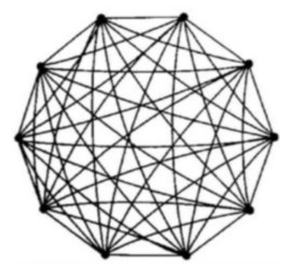
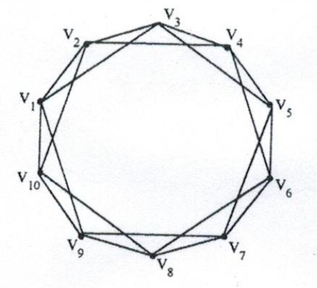

# 复杂网络动力学

## 绪论

复杂网络指具有**复杂拓扑结构**和**动力学行为**的大规模网络.

主要特征:

- 稀疏性: 具有 $N$ 个节点的网络, 连接数通常为 $O(n)$, 而非 $O(n^2)$
- 小世界特性: 平均路径长度 $L$ 较短
- 无标度特性: 节点度分布 $P(k)$ 服从幂律分布, 与系统特征长度无关.

### 复杂网络的基本概念

度 $k$, 平均度 $<k>$, **度分布函数 $P(k)$**, **聚类系数 $C(k)$**, 网络直径 $D$, 最短路径 $d$, **平均路径长度 $L$**, 介数 $B$, 点介数, 边介数, 网络介数, 核数, 中心性, 连通度, 结构熵, 特征谱

## 数理统计基础

### 分布函数变换

#### 矩母函数 (Moment Generating Function, MGF)

$$
m_X(t) = E\left[e^{tX}\right], -\infin < t < h
$$

- 不是所有的分布都有矩母函数, 如 重脱尾的 Cauchy 分布 
- 对于部分 PDF 和 CDF 比较复杂的分布, 使用矩母函数可以大大降低复杂性.
- 对于两个独立随机变量 $X$ 和 $Y$, 有 $m_{X+Y}(t) = m_X(t)m_Y(t)$

对矩母函数做 Taylor 展开, 得到:

$$
m_X(t) = \sum_{k=0}^{\infin}\frac{t^k}{k!}E[X^k] = 1 + tE[X] + \frac{t^2}{2!}E[X^2] + \frac{t^3}{3!}E[X^3] + \cdots
$$

其中, $E[X^k]$ 为 $X$ 的 $k$ 阶原点矩. 可以发现, 通过矩母函数, 可以得到 $X$ 的所有原点矩.

$$
E[X^k] = \frac{\mathrm d^k}{\mathrm dt^k}m_X(t)\bigg|_{t=0}
$$

注:

- 原点矩: $v_k(X) = E[X^k]$
- 中心矩: $\mu_k(X) = E[(X - E[X])^k]$

#### 特征函数 (Characteristic Function)

$$
\varphi_X(t) = E\left[e^{itX}\right], -\infin < t < \infin
$$

- 分布函数与特征函数构成双射
- 特征函数可以看成是 PDF 的 Fourier 变换
- 特征函数是矩母函数在虚轴上取得, 即 $\varphi_X(t) = m_X(it)$

#### 概率母函数 (Probability Generating Function, PGF)

对于在非负整数集上取值的离散随机变量 $X$, 有概率母函数:
$$
G_X(t) = E[t^X] = \sum_{k=0}^{\infin}t^kp(k)
$$

- 该式是一种 Z 变换的形式
- 若 $|t| \le 1$, 则 $G_X(t)$ 收敛  
- 概率母函数是矩母函数在对数轴上取得, 即 $G_X(t) = m_X(\ln t)$

### 经典统计分布

#### $\chi^2$ 分布

todo

注:

Gamma 函数: $\Gamma(x) = \int_0^{\infin}t^{x-1}e^{-t}\mathrm dt$

- 当 $x > 0$ 时, $\Gamma(x)$ 收敛
- $\Gamma(x+1) = x\Gamma(x)$. 特别地, $\Gamma(n+1) = n\Gamma(n) = \cdots = n!\Gamma(1) = n!$
- $\Gamma(\frac{1}{2}) = \sqrt{\pi}$

#### $t$ 分布

todo

#### $F$ 分布

todo

#### $Gamma$ 分布

$$
f(x) = \frac{x^{\alpha - 1}e^{-\frac{x}{\beta}}}{\beta^\alpha\Gamma(\alpha)}, x > 0, \alpha > 0, \beta > 0 \\
E[X] = \alpha\beta, D[X] = \alpha\beta^2
$$

todo

### 统计检验方法

#### 显著性水平

- 以真为假: $p = P\left\{\text{拒绝}H_0 | H_0 \text{成立}\right\}$
- 以假为真: $\eta = P\left\{\text{接受}H_0 | H_0 \text{不成立}\right\}$
- 目标: 在保证 $p$ 不超过临界值, 同时使 $\eta$ 尽可能小

#### Q-Q 图 (Quantile-Quantile Plot)

Q-Q 图是一种用于比较两个概率分布的图形方法. 通过将两个概率分布的分位数相互对应, 从而比较两个概率分布的相似性.

todo

#### Kolmogorov-Smirnov 检验

todo

#### $\chi^2$ 拟合优度检验

todo

### 矩阵理论

置换矩阵: 设 $P$ 为一个 $m\times n$ 维的 01 矩阵, 若 $m \le n$ 且 $PP^T=I$, 则称 $P$ 为一个置换矩阵.

定理: 当 $m \le n$ 时, $P$ 为置换矩阵的充要条件是 $P$ 的每一行恰有一个 1, 每一列恰有一个 1.

可约矩阵: 若存在一个置换矩阵 $P$, 使得 $PLP^T$ 为分块上三角阵, 则称 $L$ 为可约矩阵, 否则称 $L$ 为不可约矩阵.

定理: 矩阵 $L$ 不可约等价于其对应的有向图是强连通的.

引理: 若 $L=(a_{ij})_{N\times N}$ 是实对称不可约矩阵, 其中 $a_{ij} \ge 0 (i\neq j)$, $a_{ii} = \sum_{j=1,j\neq i}^N a_{ij}$, 则
- 0 是矩阵 $L$ 的一个重特征值, 对应特征向量为 $[1, 1, \cdots, 1]^T$
- 矩阵 $L$ 的其他特征值都小于 0
- 存在正交矩阵 $\Phi = [\phi_1, \phi_2, \cdots, \phi_N]$, 使得 $\Phi^T L \Phi = \Lambda = \mathrm{diag}(\lambda_1, \lambda_2, \cdots, \lambda_N)$, 即 $L^T\phi_i = \lambda_i\phi_i$

## 复杂网络特征的数学描述

### 静态几何特征

#### 度 (Degree) 与 度分布 (Degree Distribution)

节点度: 节点 $i$ 的度为 $k_i$, 即与节点 $i$ 相连的边的条数.

平均度: $\langle k \rangle = \frac{1}{N}\sum_{i=1}^N k_i$

度分布: $P(k) = \frac{N_k}{N}$, 其中 $N_k$ 为度为 $k$ 的节点数.

#### 无标度

许多真实网络的度分布可以用幂律分布来描述, 即 $P(k) \propto k^{-\gamma}, \gamma \in (2, 3)$. 具有幂律度分布的网络称为无标度网络.

注:

无标度特性指: 属性特征与尺度变化无关. 考虑一个 PDF $f(x)$, 无标度条件对应为 $\forall a, \exist b, f(ax)=bf(x)$, 进而可以推得

$$
f(x) = f(1)x^{-\gamma}, \gamma =-\frac{f'(1)}{f(1)}
$$

#### 累积度分布 (Cumulative Degree Distribution)

$$
P_k = \sum_{i=k}^\infty P(i)
$$

若 $P(k) \propto k^{-\gamma}$, 则 $P_k \propto k^{-(\gamma - 1)}$

#### 平均路径长度

todo

#### 聚类系数

$$
C_i = \frac{2E_i}{k_i(k_i - 1)} = \frac{a_{ii}^{(3)}}{a_{ii}^{(2)}(a_{ii}^{(2)} - 1)}
$$

### 无向网络静态特征

#### 联合度分布 (Joint Degree Distribution)

联合度分布: $P(k, k') = \frac{N_{kk'}}{N}$, 其中 $N_{kk'}$ 为度为 $k$ 和 $k'$ 的节点对数.

#### 度-度相关性

todo

#### 聚类系数分布函数

#### 聚-度相关性

局部聚类系数 $C(k)$

统计表示, 真实网络存在以下关系: $C(k) \propto k^{-1}$. 具有该特性的网络称为**层次网络**.

#### 介数

#### 核数

### 中心性

#### 度中心性

#### 介数中心性

#### 特征向量中心性

#### PageRank

#### Markov 链

### 赋权网络静态特征

### 其他静态特征

#### 网络结构熵

$$
I_i = \frac{k_i}{\sum_{j=1}^N k_j}
\\
E = -\sum_{i=1}^N I_i \ln I_i
$$

#### 网络特征谱

## 经典复杂网络模型

现实世界中的真实网络，一般都表现出**小世界特性、无标度幂律分布、高聚类系数**等特征

### 规则网络 (Regular Network)

网络中任意两个节点之间的联系遵循既定规则.

特征: 平移对称性, 每个节点的度和聚类系数相同, **聚类系数 C 大, 平均路径长度 L 长**.

#### 全局耦合网络 (Global Coupling Network, GCN)

任意两点之间都有边直接相连

$$
\begin{aligned}
&\text{度分布:} \ P(k) = \delta(k - n + 1)
\\
&\text{聚类系数:} \ C = C_i = 1
\\
&\text{平均路径长度:} \ L = L_{ij} = 1
\end{aligned}
$$

局限性: 实际复杂网络较稀疏, 边数为 $O(n)$, 而非 $O(n^2)$.

#### 最近邻耦合网络 (Nearest Neighbor Coupling Network, NCN)

每个节点只与其最近邻的 $K$ 个节点相连, 解决 GCN 的局限性

$$
\begin{aligned}
&\text{度分布:} \ P(k) = \delta(k - K)
\\
&\text{聚类系数:} \ C = C_i = \frac{\left(\frac{K}{2}-1\right)\left(\frac{K}{2}+1\right) + \Sigma_{i=0}^{\frac{K}{2}-2}i}{\frac{1}{2}K(K-1)} = \frac{3(K - 2)}{4(K - 1)}
\\
&\text{平均路径长度:} \ L = L_{ij} = 1
\end{aligned}
$$

#### 星形耦合网络 (Star Coupling Network, SCN)

### 随机网络

#### Erdos-Renyi 随机网络 (Erdos-Renyi Random Network, ERN)

若连接概率 $p$ 大于某个临界值 $p_c$, 则几乎每一个随机网络都是连通的

$$
p > p_c \propto \frac{\ln N}{N}
$$

$$
\begin{aligned}
&\text{平均度:} \ \langle k \rangle = p(N - 1) \approx pN
\\
&\text{度分布:} \ P(k) = C_{N-1}^k p^k(1-p)^{n-k} \approx \frac{e^{-\langle k \rangle} \langle k \rangle^k}{k!}
\\
&\text{直径:} \ D_{ER} = \frac{\ln N}{\ln \langle k \rangle} \approx \frac{\ln N}{\ln pN}
\\
&\text{平均路径长度:} \ L_{ER} \propto \frac{\ln N}{\ln \langle k \rangle}
\\
&\text{聚类系数:} \ C_{ER} = \frac{\langle k \rangle}{N - 1} \approx \frac{pN}{N} = p << 1
\end{aligned}
$$

特征谱: todo

### 小世界网络 (Small World Network, SWN)

#### Watts-Strogatz 小世界网络 (Watts-Strogatz Small World Network, WSSWN)

随机化重连:

#### Newman-Watts 小世界网络 (Newman-Watts Small World Network, NWSWN)

随机化加边:

#### 性质

$$
\begin{aligned}
&\text{聚类系数:} \ C_{WS}(p) = \frac{3(K - 2)}{4(K - 1)}(1 - p)^3, C_{NW}(p) = \frac{3(K - 2)}{4(K - 1) + 4K(p+2)}
\\
\end{aligned}
$$

#### 特征谱

### 无标度网络 (Scale-Free Network, SFN)

度分布服从幂律分布的网络, $P(k) \propto k^{-\gamma}$, 其中 $\gamma$ 通常在 2 到 3 之间.

#### Barabasi-Albert 无标度网络 (Barabasi-Albert Scale-Free Network, BASFN)

1. 增长特性
2. 优先连接

$$
\Pi_i = \frac{k_i + 1}{\Sigma_j (k_j + 1) }
$$

